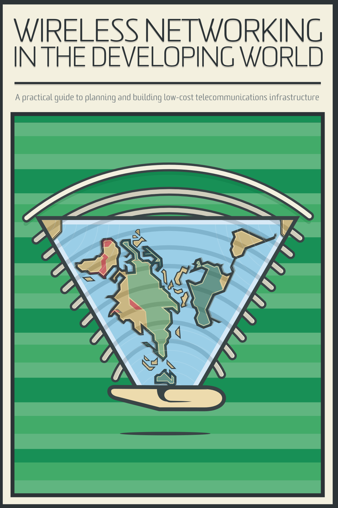

## [home](scrolls/home)

## [image server](imageserver/)

### Links


#  [Wireless Networking in the Developing World](http://wndw.net/book.html#readBook)




Self-replicating document swarm of open source book Wireless Networking in the Developing World.

Follow the following installation and then click on the link to "wndw/" from "links" and click the replicator to replicate this book. Then read it and edit it and replicate it out to the next instance.

# Basic Kit

*For about $400 we build an off-grid solar powered web server with no private information which can be shared in public with anyone*

## Stuff to buy:

 - [Raspberry Pi 4 4 gb($55)](https://www.pishop.us/product/raspberry-pi-4-model-b-4gb/)
 - [microSD Card and SD adapter($7)](https://www.pishop.us/product/microsd-card-32-gb-class-10-blank/)
 - [SD card reader($3)](https://www.pishop.us/product/high-speed-micro-sd-card-reader-maximum-128gb-black/)
  - [HDMI Screen($102)](https://www.sunfounder.com/collections/monitors/products/7-inch-hdmi-monitor)
 - [raspberry pi keyboard and mouse, official, from sunfounder($36)](https://www.sunfounder.com/collections/keyboard-gamepad/products/keyboard-mouse)
 - [solar panel and charger, (Amazon $60)](https://www.amazon.com/SOLPERK-Controller%EF%BC%8C-Automotive-Motorcycle-Powersports/dp/B07TTMF3FZ)
 - [barrel connector pigtails to connect pi screen from battery/charger/solar($9)](https://www.amazon.com/dp/B0915T6NLL)
 - [12 V 9 A-h lead acid battery($40 Amazon)](https://www.amazon.com/Rechargeable-Battery-Computer-BX1300LCD-Back-UPS/dp/B07WRXR223/)

Get a second raspberry pi board to be the permanent home server which replicates out to the public page

# Terminal Assembly


 


#  Raspberry Pi System Installation

Get a SD card with 8 GB or more storage and a SD card USB reader

Download and install, then use the Raspberry Pi Imager:

[https://www.raspberrypi.org/software/](https://www.raspberrypi.org/software/)

Turn on the pi click through all the things, put it on the wifi network.

## Install Apache and PHP so that geometron can run

Open a command prompt(black link on menu bar) and type:

```
sudo apt update
sudo apt install apache2 -y
sudo apt install php libapache2-mod-php -y
```

## Install geometron with this document for self-documentation and replication

```
cd /var/www/html
sudo rm index.html
sudo curl -o replicator.php https://raw.githubusercontent.com/LafeLabs/pi/main/php/replicator.txt
cd ..
sudo chmod -R 0777 *
cd html
php replicator.php
sudo chmod -R 0777 *
```

Check the IP address by hovering over the wifi icon, put that into the browser on another machine on the same local wifi network to see and edit the server.  Or open a browser on the pi and point it to [http://localhost](http://localhost)

## Enable VNC

From the menu, select

preferences>raspberry pi configuration>interfaces

click radio button to turn VNC on

## Set up to have names for other servers

edit hosts file to have the IP address of the other servers and then the name you want to use, copying the format in the existing file.

```
sudo nano /etc/hosts
```

edit, and use control-x and say "yes" to save changes.

## connect pi to outside internet over router

Look up "set up port forwarding raspberry pi" and follow instructions to log onto your router and forward port 80 to the raspberry pi.  Use [whatismyipaddress.com](https://whatismyipaddress.com/) to get your global IP address.  Now your home Raspberry pi server will be visible on that IP address.  Take that address and make it a link on the remote raspberry pi terminal as well as a QR code on both.   

edit the /etc/hosts file on the remote pi terminal so that home/ and remote/ point to home pi server either on the local network or on the public network.  So "home" will point to the local IP address on the wifi and "remote" will point to the global IP address of the home raspberry pi server(which everyone can see).  


The home server can now have a link to itself and also to a QR code page which points to the IP address.  Then the remote pi terminal has a link at the top so that localhost points to the home server, which then points to the QR code which passerby can scan.  Then all the passerby are directed by raw QR code to a raw IP address.  The Operator makes changes to the home pi using the remote pi.  The remote pi has links to the specific tools on the home server, using the shortcuts, e.g.: "http://trashrobotremote/classifieds/postad.html".


[link to pi my life up](https://pimylifeup.com/raspberry-pi-port-forwarding/)

[link to setting up basic website with pi with external connection](http://unixetc.co.uk/2013/09/21/create-a-basic-website-on-a-raspberry-pi/)

## Install arduino

```
sudo apt-get install arduino
```

this installs a old version which is missing some features, namely the serial plotter.  following more complicated instructions leads to non-working version which is impossible to uninstall.


how to do the tar ball thing to get a later version of arduino which has the plotting

[https://www.raspberrypi-spy.co.uk/2020/12/install-arduino-ide-on-raspberry-pi/](https://www.raspberrypi-spy.co.uk/2020/12/install-arduino-ide-on-raspberry-pi/)

go get the Arduino software at:

[https://www.arduino.cc/en/software](https://www.arduino.cc/en/software)

and download "Linux ARM 32 bits".

Open a terminal and go to the home directory:

```
cd ~
```

Go to downloads folder:
```
cd Downloads
```
list the files with 
```
ls
```
See the name of an archive with a name like "arduino-####-linuxarm.tar.xz", where #### is a version number.

extract with 
```
tar -xf arduino-####-linuxarm.tar.xz
```

move the extracted information to opt directory(directory for package installation)

```
sudo mv arduino-#### /opt
```

then run the install script:
```
sudo /opt/arduino-####/install.sh
```


## Add python that we need

[https://matplotlib.org/](https://matplotlib.org/)

matplotlib install:

```
sudo apt install python3-matplotlib
```

[https://matplotlib.org/](https://matplotlib.org/)

[https://www.instructables.com/Jupyter-Notebook-on-Raspberry-Pi/](https://www.instructables.com/Jupyter-Notebook-on-Raspberry-Pi/)

```
sudo apt-get update
sudo apt-get install python3-scipy
sudo pip3 install --upgrade pip
reboot
sudo pip3 install jupyter
```


## Links

 - [qrcode.html](qrcode.html)
 - [ipaddress.php](ipaddress.php)
 - [http://localhost/](http://localhost/)
 - [../](../)
 - [fork.html](fork.html)
 - [user.php](user.php)
 - [index.html](index.html)
 - [readme.html](readme.html)
 - [editor.php](editor.php)
 - [dnagenerator.php](dnagenerator.php)
 - [global page replicator code link](https://raw.githubusercontent.com/LafeLabs/pi/main/servers/scrollserver/php/replicator.txt)
 - [local replicator code link](php/replicator.txt)
 - [scroll set replicator](scrollset.html)
 - [set replicator](set.html)
 - [replicator.php](replicator.php)

## copy replicators to local replicator.php

 - [copy wall server replicator](copy.php?from=https://raw.githubusercontent.com/LafeLabs/pi/main/servers/wall/php/replicator.txt&to=replicator.php)
 - [copy page server replicator](copy.php?from=https://raw.githubusercontent.com/LafeLabs/pi/main/servers/page/php/replicator.txt&to=replicator.php)
 - [copy mathpage server replicator](copy.php?from=https://raw.githubusercontent.com/LafeLabs/pi/main/servers/mathpage/php/replicator.txt&to=replicator.php)
 - [copy code server replicator](copy.php?from=https://raw.githubusercontent.com/LafeLabs/codeserver/main/php/replicator.txt&to=replicator.php)
 - [copy full geometron server replicator](copy.php?from=https://raw.githubusercontent.com/LafeLabs/pi/main/servers/geometron/php/replicator.txt&to=replicator.php)
 - [copy image server replicator](copy.php?from=https://raw.githubusercontent.com/LafeLabs/pi/main/servers/imageserver/php/replicator.txt&to=replicator.php)
 - [copy map server replicator](copy.php?from=https://raw.githubusercontent.com/LafeLabs/pi/main/servers/mapserver/php/replicator.txt&to=replicator.php)
 - [copy scroll server replicator](copy.php?from=https://raw.githubusercontent.com/LafeLabs/pi/main/servers/scrollserver/php/replicator.txt&to=replicator.php)
 - [copy symbol server replicator](copy.php?from=https://raw.githubusercontent.com/LafeLabs/pi/main/servers/symbolserver/php/replicator.txt&to=replicator.php)
 - [copy icon server replicator](copy.php?from=https://raw.githubusercontent.com/LafeLabs/pi/main/servers/iconserver/php/replicator.txt&to=replicator.php)

## links to replicators

 - [wall server replicator](https://raw.githubusercontent.com/LafeLabs/pi/main/servers/wall/php/replicator.txt)
 - [page server replicator](https://raw.githubusercontent.com/LafeLabs/pi/main/servers/page/php/replicator.txt)
 - [mathpage server replicator](https://raw.githubusercontent.com/LafeLabs/pi/main/servers/mathpage/php/replicator.txt)
 - [board server replicator](https://raw.githubusercontent.com/LafeLabs/pi/main/servers/boardserver/php/replicator.txt)
 - [code server replicator](https://raw.githubusercontent.com/LafeLabs/pi/main/servers/codeserver/php/replicator.txt)
 - [CHAOS server replicator](https://raw.githubusercontent.com/LafeLabs/pi/main/servers/chaos/php/replicator.txt)
 - [full geometron server replicator](https://raw.githubusercontent.com/LafeLabs/pi/main/servers/geometron/php/replicator.txt)
 - [image server replicator](https://raw.githubusercontent.com/LafeLabs/pi/main/servers/imageserver/php/replicator.txt)
 - [map server replicator](https://raw.githubusercontent.com/LafeLabs/pi/main/servers/mapserver/php/replicator.txt)
 - [scroll server replicator](https://raw.githubusercontent.com/LafeLabs/pi/main/servers/scrollserver/php/replicator.txt)
 - [symbol server replicator](https://raw.githubusercontent.com/LafeLabs/pi/main/servers/symbolserver/php/replicator.txt)
 - [icon server replicator](https://raw.githubusercontent.com/LafeLabs/pi/main/servers/iconserver/php/replicator.txt)
 - [classifieds server replicator](https://raw.githubusercontent.com/LafeLabs/pi/main/servers/classifieds/php/replicator.txt)